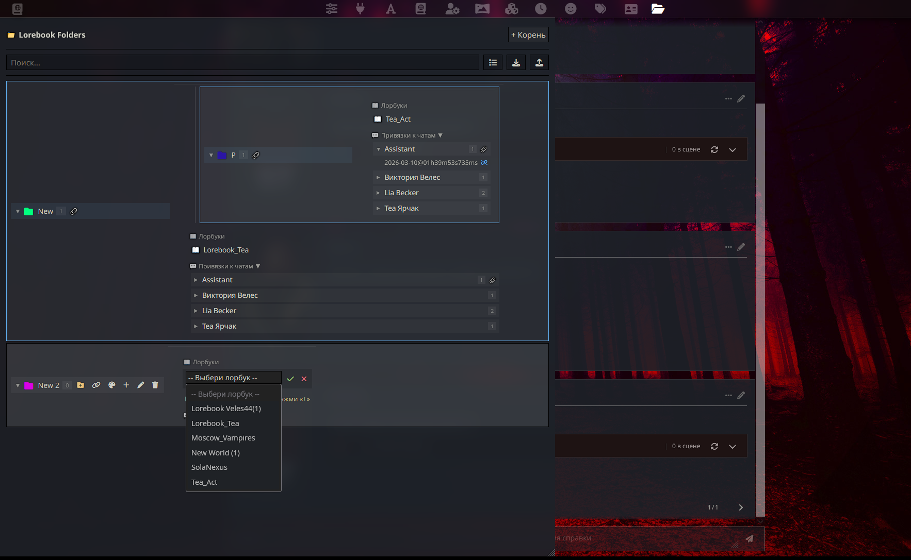

# 📚 ST Lorebook Folders & Binder — Update v1.1.0-beta

Настоящая магия автоматизации! Группируйте лорбуки по папкам (и подпапкам) и намертво привязывайте их к конкретным чатам. Как только вы открываете диалог, нужные лорбуки автоматически встают в "Активные миры для всех чатов", а при выходе — выгружаются. Больше никакой рутины с галочками!

⚠️ **BETA VERSION:** Мы активно развиваемся! Перед обновлением обязательно сделайте бэкап своих данных через новую функцию Экспорта.

Это масштабное обновление полностью переосмысляет работу с лорбуками в SillyTavern, делая интерфейс чище, а управление — профессиональнее.

## 📸 Интерфейс

P.S Цвет и стиль интерфейса меняется в зависимости от вашей темы.

## 🚀 Что нового?

### ⚡ Прощай, Popups! (Inline UI)
Мы полностью отказались от системных окон `prompt()`. Теперь всё управление происходит внутри интерфейса:
* **Инлайн-поля:** Создание и переименование папок теперь происходит в аккуратных текстовых полях прямо в списке.
* **Встроенный выбор:** Добавление лорбуков реализовано через удобный выпадающий список внутри каждой папки.

### 📁 Продвинутая иерархия
* **Бесконечная вложенность:** Создавайте папки внутри папок («матрешка») без ограничений.
* **Умное удаление:** При удалении папки расширение корректно очищает все вложенные элементы.
* **Визуальные связи:** Подпапки соединены линиями, чтобы вы всегда видели структуру своего мира.

### 🔍 Навигация и Контроль
* **Живой поиск:** Мгновенная фильтрация лорбуков и папок по ключевым словам.
* **Компактный режим:** Специальный переключатель для тех, у кого сотни лорбуков — уменьшает элементы, чтобы на экран влезло всё.
* **Drag & Drop:** Просто перетаскивайте папки мышкой, чтобы выстроить идеальный порядок.

### 🎨 Кастомизация и UX
* **Цветовая маркировка:** Назначайте папкам цвета! Отделите "Вампирскую Москву" красным, а "Фэнтези" — зеленым.
* **Плавный интерфейс:** Добавлены мягкие анимации открытия/закрытия списков (`slideToggle`).

### 📱 Мобильная адаптация
* Теперь панель расширения автоматически подстраивается под экраны смартфонов, растягиваясь на всю ширину для удобного управления пальцами.

### 🛡️ Сохранность данных (Backup)
* **Экспорт/Импорт:** Добавлена возможность скачать всю структуру ваших папок в `.json` и загрузить её обратно. Теперь ваши настройки в безопасности!

## 🛠️ Установка / Обновление

1. Зайдите в **Extensions** -> **Install Extension**.
2. Используйте ссылку: `https://github.com/Gromova-Olga/ST-Lorebook-Folders`
3. Если расширение уже установлено — нажмите **Update** во вкладке расширений.

## 📞 Обратная связь

Нашли баг или хотите предложить идею?
[👉 Мой канал в Telegram](https://t.me/Ethereal_Tavern)
